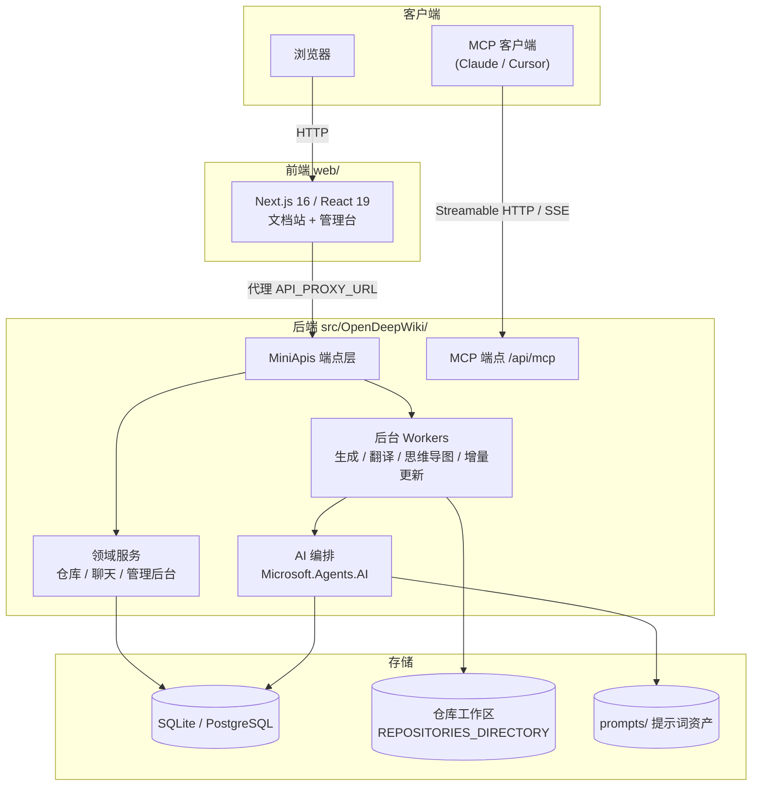

# 系统架构

OpenDeepWiki 采用前后端分离架构：ASP.NET Core 负责 API 与后台处理，Next.js 负责界面与 SEO 友好的文档站。

## 总体拓扑



## 技术栈

| 层 | 技术 |
| --- | --- |
| 后端运行时 | .NET 10 / ASP.NET Core（MiniApis 风格端点） |
| AI 编排 | Microsoft.Agents.AI + `src/OpenDeepWiki/prompts` 提示词资产 |
| 前端 | Next.js 16、React 19、App Router、Tailwind CSS 4 |
| ORM | EF Core（多 Provider：SQLite / PostgreSQL） |
| 仓库处理 | LibGit2Sharp（Git）、ZIP 解压、本地目录导入 |
| 部署 | Docker Compose、Makefile、可选 Sealos |

## 后端项目分层

| 项目 | 职责 |
| --- | --- |
| `src/OpenDeepWiki` | 端点（`Endpoints/`）、后台 Worker（`Services/*Worker*`）、AI/仓库/聊天/MCP 服务、`prompts/` |
| `src/OpenDeepWiki.Entities` | 领域实体（`AggregateRoot<TKey>` 基类） |
| `src/OpenDeepWiki.EFCore` | 共享 `MasterDbContext` 与上下文契约 |
| `src/EFCore/OpenDeepWiki.Sqlite` | SQLite Provider（`SqliteDbContext`） |
| `src/EFCore/OpenDeepWiki.Postgresql` | PostgreSQL Provider（`PostgresqlDbContext`） |

请求链路：`Endpoint → 领域服务 → EF Core → 数据库`；重活（生成、翻译、导图、增量）不入请求链路，而是写任务表由 Worker 异步消费。

## 前端结构

```
web/
├── app/
│   ├── (main)/          # 主布局：探索、私有仓库、应用、MCP 服务等
│   ├── [owner]/[repo]/  # 公共文档站路由（SEO 友好）
│   ├── admin/           # 管理后台
│   ├── auth/            # 登录注册
│   └── share/           # 聊天分享快照
├── components/          # repo / chat / admin 等组件库
├── lib/                 # API 客户端、工具函数
└── i18n/                # 8 种 UI 语言包
```

前端不直连数据库，所有数据经 `API_PROXY_URL` 代理到后端；文档路由 `/{owner}/{repo}/{...slug}` 直接服务端渲染，利于搜索引擎收录。

## 认证与安全

- 登录签发 JWT（`JWT_SECRET_KEY` HMAC-SHA256），前端携带 Token 调用 API
- 角色模型：`Admin` / `User`（可扩展自定义角色）
- 私有仓库按归属用户与部门控制可见性；公开仓库匿名可读
- 本地目录导入有 `AllowedLocalPathRoots` 白名单硬边界

## 关键设计决策

| 决策 | 理由 |
| --- | --- |
| 任务表 + Worker 而非内存队列 | 重启不丢任务、多实例共享配额、可观测 |
| MiniApis 而非 MVC Controller | 端点即函数，减少样板代码 |
| prompts 独立目录 | 提示词与代码解耦，支持部署期定制（见[提示词定制](/docs/advanced/prompts)） |
| 多数据库 Provider | 单机零配置（SQLite）与生产规模（PostgreSQL）兼顾 |
