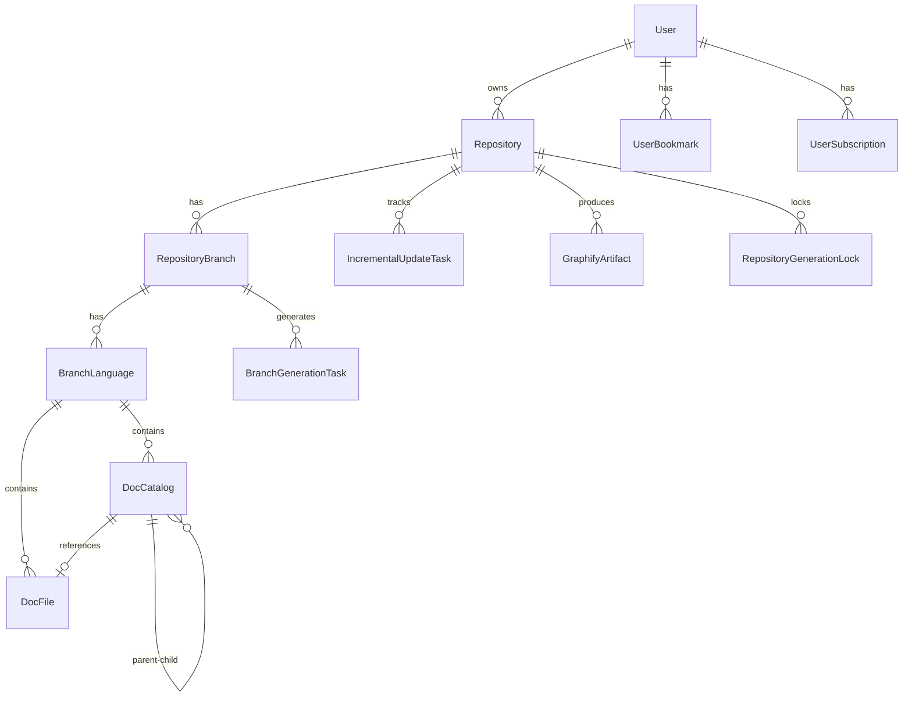

# 数据模型

## 概览

所有实体都继承自 `AggregateRoot<TKey>`，它提供用于审计和软删除的通用字段：

| 字段 | 类型 | 描述 |
|-------|------|-------------|
| `Id` | `TKey` | 主键（通常为 `string`，GUID 格式） |
| `CreatedAt` | `DateTime` | 创建时间戳（UTC） |
| `UpdatedAt` | `DateTime?` | 最后更新时间戳 |
| `DeletedAt` | `DateTime?` | 软删除时间戳 |
| `IsDeleted` | `bool` | 软删除标志 |
| `Version` | `byte[]?` | 乐观并发令牌 |

## 实体关系图



## 核心实体

### Repository

代表提交用于分析和文档生成的 Git 仓库。

| 字段 | 类型 | 描述 |
|-------|------|-------------|
| `OwnerUserId` | `string` | 提交仓库的用户 ID |
| `GitUrl` | `string` | Git 克隆 URL（ZIP/本地目录导入时可为空） |
| `RepoName` | `string` | 仓库名称 |
| `OrgName` | `string` | 组织或所有者名称 |
| `AuthAccount` / `AuthPassword` | `string?` | Git 认证用户名/令牌（私有仓库） |
| `IsPublic` | `bool` | 仓库是否公开可见 |
| `GenerateSkill` | `bool` | 是否生成 Skill Markdown 产物 |
| `ScanDepthMode` | 枚举 | 扫描深度模式（Auto 或手动覆盖） |
| `DirectoryTreeDepthOverride` 等扫描字段 | `int?` | 目录树/文件列表深度、节点数与文件数预算覆盖 |
| `Status` | `RepositoryStatus` | `Pending`、`Processing`、`Completed`、`Failed` |
| `StarCount` / `ForkCount` / `ViewCount` 等 | `int` | 平台统计计数 |
| `PrimaryLanguage` | `string?` | 主要编程语言 |
| `UpdateIntervalMinutes` | `int?` | 自定义增量更新检查间隔 |
| `IsDepartmentOwned` | `bool` | 是否为部门持有仓库 |

### RepositoryBranch

代表已处理仓库的特定分支。

| 字段 | 类型 | 描述 |
|-------|------|-------------|
| `RepositoryId` | `string` | 父仓库 ID |
| `BranchName` | `string` | 分支名称（例如 `main`） |
| `LastCommitId` | `string?` | 最后处理的提交 SHA |
| `GenerationStatus` | 枚举 | 分支最新一次生成的状态 |

### BranchLanguage

代表特定分支的文档语言变体。每个分支可以生成多种语言的文档。

| 字段 | 类型 | 描述 |
|-------|------|-------------|
| `RepositoryBranchId` | `string` | 父分支 ID |
| `LanguageCode` | `string` | 语言代码（例如 `en`、`zh`、`ja`、`ko`） |
| `UpdateSummary` | `string?` | 最新更新摘要 |
| `IsDefault` | `bool` | 是否为默认语言 |
| `MindMapContent` | `string?` | Markdown 标题格式的思维导图内容 |
| `MindMapStatus` | 枚举 | 思维导图生成状态：等待/生成中/完成/失败 |
| `SkillMarkdown` | `string?` | Skill 产物内容 |

### DocCatalog

代表文档目录树中的节点，通过自引用 `ParentId` 支持层级结构。

| 字段 | 类型 | 描述 |
|-------|------|-------------|
| `BranchLanguageId` | `string` | 父分支语言 ID |
| `ParentId` | `string?` | 父目录 ID（根节点为 `null`） |
| `Title` | `string` | 显示标题 |
| `Path` | `string` | 语言内唯一的 URL 路径 |
| `Order` | `int` | 在父级内的排序顺序 |
| `DocFileId` | `string?` | 关联的文档文件 ID |

目录树与 AI 交互时序列化为 `CatalogItem` JSON：

```csharp
public class CatalogItem
{
    public string Title { get; set; }
    public string Path { get; set; }
    public int Order { get; set; }
    public List<CatalogItem> Children { get; set; }
}
```

### DocFile

存储实际生成的文档内容。

| 字段 | 类型 | 描述 |
|-------|------|-------------|
| `BranchLanguageId` | `string` | 父分支语言 ID |
| `Content` | `string` | 文档内容（Markdown） |
| `SourceFiles` | `string?` | 用于生成此文档的源文件路径 |

### User

| 字段 | 类型 | 描述 |
|-------|------|-------------|
| `Name` | `string` | 用户名 |
| `Email` | `string` | 电子邮件地址 |
| `Password` | `string?` | 哈希密码（BCrypt） |
| `Status` | `int` | `0` = 禁用，`1` = 活跃，`2` = 待验证 |
| `IsSystem` | `bool` | 是否为系统用户（不可删除） |
| `LastLoginAt` | `DateTime?` | 最后登录时间戳 |

### 任务与锁实体

| 实体 | 描述 |
|------|------|
| `BranchGenerationTask` | 分支级 Wiki 生成任务，由生成 Worker 消费 |
| `IncrementalUpdateTask` | 增量更新任务（PreviousCommit → TargetCommit、优先级、重试计数） |
| `TranslationTask` | 文档翻译任务 |
| `RepositoryGenerationLock` | 仓库生成分布式锁，防止同一仓库并发重复处理 |
| `RepositoryProcessingLog` | 每次生成的阶段化处理日志 |
| `GraphifyArtifact` | Graphify CLI 生成的知识图谱产物元数据 |

## 数据库 Provider

数据层支持多个数据库 Provider，通过 `DB_TYPE` 环境变量选择：

| Provider | DbContext | 连接字符串示例 |
|----------|-----------|---------------------------|
| SQLite | `SqliteDbContext` | `Data Source=/data/opendeepwiki.db` |
| PostgreSQL | `PostgresqlDbContext` | `Host=localhost;Database=opendeepwiki;Username=postgres;Password=xxx` |

两个 Provider 都继承自 `MasterDbContext`，它定义共享的模型配置、关系和索引。

## 辅助实体速查

| 分组 | 实体 |
|------|------|
| 聊天与应用 | `ChatApp`、`ChatSession`、`ChatLog`、`ChatMessageHistory`、`ChatMessageQueue`、`ChatProviderConfig`、`ChatAssistantConfig`、`ChatShareSnapshot`、`AppStatistics` |
| 用户行为 | `UserBookmark`、`UserSubscription`、`UserActivity`、`UserDislike`、`UserPreferenceCache`、`TokenUsage` |
| 系统配置与工具 | `McpConfig`、`McpProvider`、`ModelConfig`、`AiProviderConfig`、`AiModelConfig`、`SkillConfig`、`ApiKey`、`GitHubAppInstallation`、`LocalStorage`、`SystemSetting` |
| 仓库组织 | `RepositoryAssignment`、`Department`、`UserDepartment`、`Role`、`UserRole` |
