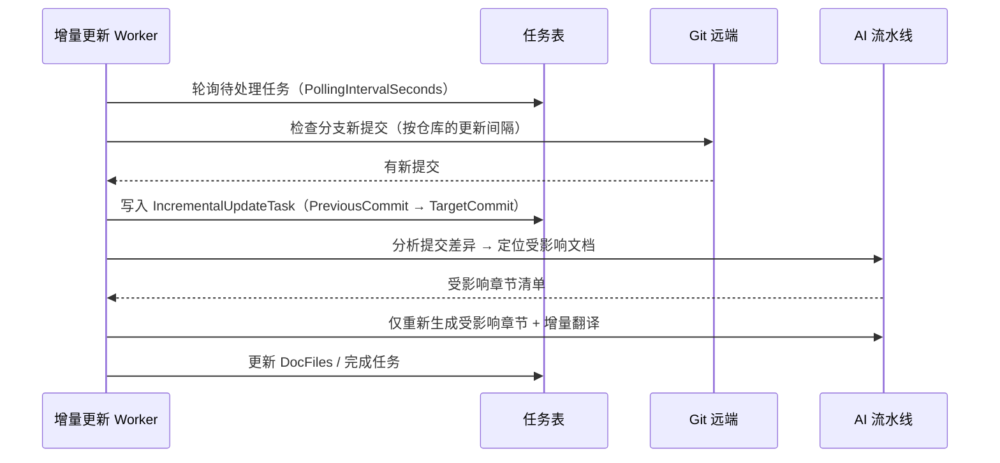

import { Callout } from "fumadocs-ui/components/callout";

# 增量更新

全量生成适合首次导入；仓库日常演进时，**增量更新**只对变更部分重新生成，省时省钱。

## 工作机制



## 配置（appsettings.json）

| 设置 | 默认值 | 描述 |
|---|---|---|
| `IncrementalUpdate:PollingIntervalSeconds` | `60` | Worker 轮询任务频率（秒） |
| `IncrementalUpdate:DefaultUpdateIntervalMinutes` | `60` | 仓库检查更新的默认间隔（分钟） |
| `IncrementalUpdate:MinUpdateIntervalMinutes` | `5` | 最小允许间隔（分钟） |
| `IncrementalUpdate:MaxRetryAttempts` | `3` | 失败重试次数（指数退避） |
| `IncrementalUpdate:RetryBaseDelayMs` | `1000` | 退避基础延迟（毫秒） |
| `IncrementalUpdate:ManualTriggerPriority` | `100` | 手动触发任务的优先级 |

仓库级覆盖：单个仓库可设置自定义检查间隔（`Repository.UpdateIntervalMinutes`），用于让活跃仓库更勤、归档仓库更省。

## 触发方式

- **自动**：Worker 按间隔检查（默认开启）
- **手动**：管理后台[仓库管理](/docs/admin-guide/repositories)触发检查；或调用 API：

```bash
curl -X POST https://wiki.example.com/api/v1/repositories/{repositoryId}/incremental-update \
     -H "Authorization: Bearer <token>"
```

手动触发走高优先级队列，插队执行。API 细节见 [API 参考 → 增量更新](/docs/api-reference/incremental-updates)。

## 什么会被重新生成

增量流水线按提交差异（`PreviousCommitId → TargetCommitId`）决定：

| 变更 | 处理 |
| --- | --- |
| 源码文件变更 | 重新生成受影响的章节 |
| 新增模块/目录 | 目录树补充新章节并生成 |
| README 变更 | 刷新项目概览 |
| 文档正文变更 | 对应章节的翻译任务增量派发 |
| 仅配置/文档小改 | 可能判定为无需更新（省 Token） |

思维导图随文档变化一并刷新。

## 常见问题

**迟迟不检查更新**
确认 Worker 存活（后端日志）；确认仓库间隔未被设得过长。

**增量后文档仍显陈旧**
差异分析未覆盖到该章节时，可在后台直接对该仓库重新生成（全量）。

**多实例部署**
配额与锁共享（`WIKI_MAX_CONCURRENT_GENERATIONS` + 生成锁），重复触发不会导致并发双写。
