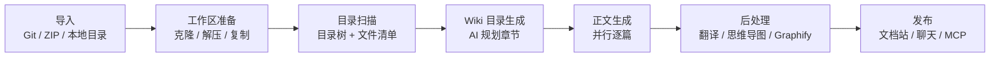

import { Callout } from "fumadocs-ui/components/callout";

# 仓库处理流水线

一次仓库生成 = 一条多阶段流水线。理解它，你就能判断"卡住了在哪一步""为什么贵""失败怎么救"。

## 阶段总览

## 各阶段细节

### 1. 工作区准备

- Git 来源：LibGit2Sharp 克隆并检出目标分支（私有仓库用表单里的 Token）
- ZIP 来源：解压到工作区
- 本地目录：按 `LocalDirectoryImportMode` 复制（Copy）或引用（Reference）

工作区统一放在 `REPOSITORIES_DIRECTORY`（Docker 默认 `/data`）。

### 2. 目录扫描

递归构建目录树与文件清单，遵循：

- 尊重 `.gitignore`
- 预算控制：`WIKI_DIRECTORY_TREE_MAX_DEPTH`（默认 2 层）、`WIKI_MAX_TREE_NODES`（默认 1200 节点）、`WIKI_FILE_LIST_MAX_DEPTH`
- 可选 `WIKI_ENABLE_AI_SCAN_PROFILE`：让 AI 依据仓库规模自动选择扫描深度与文件数预算

### 3. Wiki 目录生成

把 README 摘要（截断到 `WIKI_README_MAX_LENGTH`）与目录树交给**目录模型**（`WIKI_CATALOG_*`），产出层级章节规划（`CatalogItem` 树：标题 + 路径 + 子节点）。目录质量决定整本文档的结构，值得用好模型。

### 4. 正文生成

按目录**并行**逐篇生成，并发度 `WIKI_PARALLEL_COUNT`（默认 5）。每篇文档：

- 输入：该章节对应的目录节点、相关源文件内容
- 生成模型：`WIKI_CONTENT_*`
- 单篇超时：`WIKI_DOCUMENT_GENERATION_TIMEOUT_MINUTES`（默认 60 分钟）
- 输出上限：`WIKI_MAX_OUTPUT_TOKENS`
- 支持工具调用读取仓库文件（上限 `WIKI_MAX_DOCUMENT_SOURCE_TOOL_CALLS`）与追加续写（`WIKI_MAX_DOCUMENT_APPEND_OPERATIONS`）
- 失败重试：`WIKI_MAX_RETRY_ATTEMPTS` 次，间隔 `WIKI_RETRY_DELAY_MS`

产物写入 `DocFiles`（Markdown），挂到 `DocCatalogs` 目录节点上。

### 5. 后处理

正文完成后由 Worker 继续派发：

| 任务 | 产物 |
| --- | --- |
| 翻译 | `WIKI_LANGUAGES` 中其余语种的 `BranchLanguage` + 翻译后文档 |
| 思维导图 | 架构思维导图（Markdown 标题层级，存 `BranchLanguage.MindMapContent`） |
| Graphify（可选） | 知识图谱产物，输出到 `GRAPHIFY_OUTPUT_ROOT` |
| Skill 生成 | 仓库知识打包的 SKILL Markdown/ZIP |

### 6. 发布

数据落库即可访问：文档站路由、AI 对话、MCP 端点、嵌入式应用共享同一份知识。

## 并发与任务模型

- 每个阶段的任务落库（`BranchGenerationTask` 等），由 Worker 轮询消费，**服务重启不丢任务**
- 全局生成配额 `WIKI_MAX_CONCURRENT_GENERATIONS`（默认 1）：多实例部署时共享，防止打爆 AI 服务商
- 同一仓库用 `RepositoryGenerationLock` 防止并发重复生成

## 失败处理

| 现象 | 阶段 | 处理 |
| --- | --- | --- |
| 克隆失败 | 准备 | 检查地址/Token/网络，重试生成 |
| 目录为空 | 扫描 | 仓库过小或全被 ignore；检查预算参数 |
| 生成 401/429 | 目录/正文 | AI 凭证或限流，修好后重新生成 |
| 某篇失败其余成功 | 正文 | 看处理日志定位该篇，整仓重试 |
| 翻译缺失 | 后处理 | 翻译模型配置错误；修复后重试 |

进度与日志入口：管理后台[仓库管理](/docs/admin-guide/repositories)。
